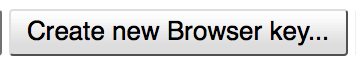
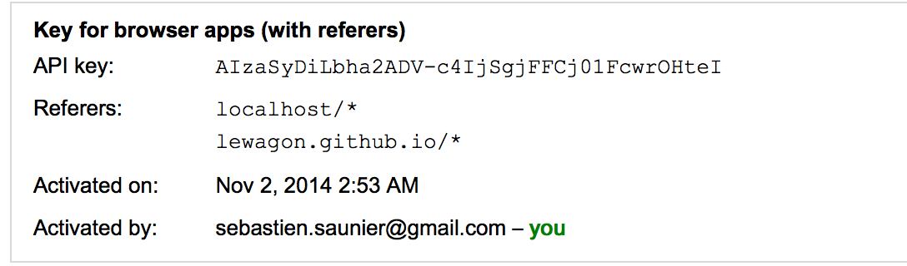

# Google Place Autocomplete

This sample code show you how to quickly use the Places Autocomplete javascript
API from Google.

[See demo right now](http://lewagon.github.io/google-place-autocomplete)

## Code

Look at the [index.html](index.html) file, you'll see a very standard form.
The input with id `user_input_autocomplete_address` is very important as it
is bound to an `autocomplete` object in the `autocomplete.js` code.

The code you see is not dependent on jQuery, also the `initializeAutocomplete`
method has to be called when `google` is ready, not just when the DOM is ready.

## API Key

In order to get a lot of requests for free to the API, you need to create a
new project under the [Google API Console](https://code.google.com/apis/console).
For this project, enable the Google Maps Javascript API v3:

Then, for this project, create a new "Browser Key", the one you'll put in the
`index.html` file when calling the `https://maps.googleapis.com/maps/api/js` script.

Make sure to specify referers so that **only you** can use this key! Remember,
you API calls are limited per day.

## Documentation

[Full Reference](https://developers.google.com/maps/documentation/javascript/places-autocomplete)